  <!-- يمكنك إضافة صورة رأسية هنا في المستقبل لجعلها أكثر إبهاراً -->
  <!--  -->

  <h1>𝗧𝗛𝗘 𝗠𝗔𝗘𝗦𝗧𝗥𝗢 𝗖𝗢𝗖𝗞𝗣𝗜𝗧</h1>
  <h3>قمرة القيادة الاستراتيجية لتوليد المحتوى المعماري فائق الجودة</h3>

  

    <!-- الروابط الآن كاملة وصحيحة -->
    
    
    
  

---

> "الفوضى في المدخلات، تؤدي حتمًا إلى فوضى في المخرجات. مشروع Maestro هو بروتوكول لفرض النظام والذكاء والدقة في العلاقة بين الإنسان والنموذج اللغوي الكبير (LLM)، محولاً عملية توليد المحتوى من مجرد طلب استجابة إلى قيادة سيمفونية معمارية."

 

## ■ **المفهوم الاستراتيجي (The Strategic Concept)**

في عصر المحتوى الذي تتولى فيه الذكاء الاصطناعي مهامًا متزايدة، تظهر فجوة خطيرة بين **النية** البشرية و**التنفيذ** الآلي. مشروع `The Maestro Cockpit` ليس مجرد أداة، بل هو فلسفة عمل متكاملة مصممة لسد هذه الفجوة.

إنه يعمل كـ **وسيط إدراكي (Cognitive Mediator)** بين العقل البشري الاستراتيجي (خبير المحتوى) والنموذج اللغوي التنفيذي (المُصمم المعماري). بدلاً من كتابة أوامر (prompts) عشوائية، يقوم المستخدم بتحديد **الجوهر (`THE_SOUL`)** و **الحمض النووي للقالب (`TEMPLATE_DNA`)**، بينما تتولى الأداة صياغة بروتوكول صارم ومفصل—**بروتوكول جينيسيس (`Genesis Protocol`)**—لضمان بناء المكونات الرقمية بدقة متناهية.

---

## ■ **المعمارية الفكرية: بروتوكول من مرحلتين**

يكمن جمال هذا النظام في فصله الواضح بين **الاستراتيجية** و **التنفيذ**، ممثلاً في بروتوكولين رئيسيين:

#### ➊ **بروتوكول المايسترو (The Maestro Protocol)**

*   **الكيان:** النموذج اللغوي الأول (المحلل الاستراتيجي).
*   **المهمة:** تحليل المحتوى الخام (`article-filled.txt`)، وتنقيحه، وإثرائه، ثم استنتاج المكونات الهيكلية المطلوبة بذكاء (`TEMPLATE_DNA`).
*   **الناتج:** توليد **بروتوكول جينيسيس**—خطة المعركة الكاملة.

#### ➋ **بروتوكول جينيسيس (The Genesis Protocol)**

*   **الكيان:** النموذج اللغوي الثاني ("المُصمم المعماري" - The Architect).
*   **المهمة:** تلقي الخطة المُحكمة وتنفيذها بدقة متناهية لبناء مكونات HTML متوافقة مع `Ai8V Schema Architect`.
*   **الناتج:** كود HTML نقي، عالي الأداء، ومتوافق هيكليًا.

 

### **خريطة تدفق العمليات (Workflow)**

```mermaid
graph TD;
    A[المستخدم يقدم المحتوى الخام] --> B{The Maestro Protocol};
    B --> C[1. تحليل وتنقية النص];
    C --> D[2. كشف المخططات واستنتاج TEMPLATE_DNA];
    D --> E[3. استنتاج الأصول البصرية ASSET_MANIFEST];
    E --> F[📝 توليد بروتوكول جينيسيس النهائي];
    F --> G{The Genesis Protocol};
    G --> H[🏗️ بناء مكونات HTML النهائية];
    H --> I[🚀 تسليم كود HTML جاهز للنشر];

    style B fill:#2E3440,stroke:#88C0D0,stroke-width:2px;
    style G fill:#2E3440,stroke:#88C0D0,stroke-width:2px;
    style F fill:#4C566A,stroke:#A3BE8C,stroke-width:2px;
    style H fill:#4C566A,stroke:#A3BE8C,stroke-width:2px;
```

ذذ

---

## ■ **المكونات الأساسية للمشروع (Core Components)**

| الملف                          | الوصف                                                                                                    | التقنية/النمط المتبع                             |
| ------------------------------ | -------------------------------------------------------------------------------------------------------- | --------------------------------------------------- |
| **`index.html`**               | **قمرة القيادة (The Cockpit):** الواجهة التفاعلية التي تتيح للمستخدم إدخال البيانات وتوليد البروتوكول.          | `HTML5`, `Bootstrap 5.3`, `ARIA`                    |
| **`maestro-cockpit.js`**       | **المنطق التحكمي (Controller):** يدير أحداث الواجهة، ويجمع المدخلات، وينسق عملية التوليد.                   | `Vanilla JS (ES6+)`, `DOM Manipulation`             |
| **`genesis-protocol-generator.js`** | **محرك التوليد (Generator Engine):** وحدة مستقلة مسؤولة عن بناء البروتوكول النهائي.                      | `Vanilla JS`, `Revealing Module Pattern`          |
| **`toast-utility.js`**         | **وحدة الإشعارات الخدمية (Utility):** توفر تغذية راجعة مرئية للمستخدم عند إتمام العمليات.                   | `Bootstrap 5 Toasts`, `Utility Function`            |
| **`THE MAESTRO PROTOCOL.txt`** | **البروتوكول الاستراتيجي:** التعليمات الموجهة للنموذج اللغوي الأول (المحلل) لتوليد خطة الهجوم.           | `Prompt Engineering`                                |
| **`GENESIS PROTOCOL.txt`**     | **البروتوكول التنفيذي:** القالب الرئيسي الذي يتم ملؤه بواسطة "المايسترو" ليتم تنفيذه بواسطة "المُصمم".     | `Prompt Engineering`, `Template-based Generation`   |

---

## ■ **البدء السريع (Quick Start)**

1.  **استكشف الواجهة:**
    *   قم بزيارة [**العرض الحي للأداة من هنا**](https://ai8v.github.io/maestro/).

2.  **التجربة العملية:**
    1.  **الخطوة 1:** الصق أي مقال في حقل `"النص الخام (THE_SOUL)"`.
    2.  **الخطوة 2:** اختر المكونات المطلوبة من قائمة `"TEMPLATE_DNA"`.
    3.  **الخطوة 3:** اضغط على **"قم بالتحليل وتوليد البروتوكول"**.
    4.  **الخطوة 4:** انسخ البروتوكول الناتج واستخدمه مع أي نموذج لغوي كبير متقدم.
---

## ■ **فلسفة التصميم (Design Philosophy)**

*   **الدقة فوق المرونة (Precision Over Flexibility):** تم تصميم النظام لإنتاج مخرجات متوقعة ومتوافقة 100% مع معمارية `Ai8V`.
*   **فصل الاهتمامات (Separation of Concerns):** فصل تام بين منطق الواجهة، منطق توليد البيانات، والوحدات الخدمية.
*   **الاستقلالية (Zero Dependencies):** يعتمد المشروع فقط على Bootstrap و Vanilla JS لضمان أقصى سرعة وأقل تعقيد.
*   **التركيز على تجربة المطور (Developer-First Experience):** كود نظيف، مُعلق عليه جيداً، ومنظم بشكل يسهل فهمه وتطويره.

---

## ■ **المساهمة وخارطة الطريق**

هذا المشروع في مراحله الأولى ولكنه يحمل رؤية كبيرة. المساهمات التي تركز على تحسين الذكاء التحليلي للبروتوكولات، أو إضافة قوالب جديدة، أو تحسين تجربة المستخدم هي موضع ترحيب كبير.

*   **تحسين المحلل الذكي:** تطوير قدرة `Maestro Protocol` على فهم السياقات المعقدة.
*   **مكتبة قوالب موسعة:** إضافة المزيد من المكونات المتوافقة مع `Ai8V`.
*   **المعاينة المباشرة:** إضافة `iframe` لعرض الناتج النهائي مباشرة في الواجهة.

---

## ■ **الترخيص**

هذا المشروع مرخص بموجب [ترخيص MIT](https://github.com/AI8V/maestro/blob/main/LICENSE).
